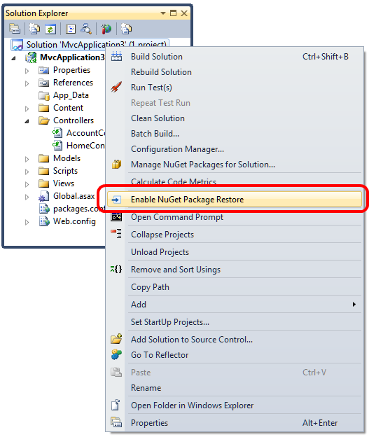

NuGet 1.6 was [released today](http://docs.nuget.org/docs/release-notes/nuget-1.6). And with it came some great new features, one that I am particularly excited about is.

> ##### Using NuGet Without Checking In Packages (Package Restore)
>
> NuGet 1.6 now has first class support for the workflow in which NuGet packages are not added to source control, but instead are restored at build time if missing. For more details, read the [Using NuGet without committing packages to source control](http://docs.nuget.org/docs/Workflows/Using-NuGet-without-committing-packages) topic.

The reason for this is that it finally allows us to remove the **packages** directory and all the packages from our repository.  Which I always thought created a mess of source control systems, and required unnecessary check-ins. It also created a huge amount of bloat especially since some projects (cough… NUnit) included so much extra crap that nobody needed and required all that extra storage space in the repository and commit history.

#### Setup

Let’s assume that you have a solution that is either already using NuGet, or planning to use it, and that you want to set up the no-commit workflow.

Right click on the *Solution* node in Solution Explorer and select *Enable NuGet Package Restore*.



**That's it!** You're all set.

*(taken from <http://docs.nuget.org/docs/Workflows/Using-NuGet-without-committing-packages>)*

#### .gitignore

Next we will want to add the following to your **.gitignore** file. (create one if you don’t already have one) And add the following to the top of it.

```
# Don't include NuGet Packages  
packages/
```

This will make sure any changes in the packages directory will be ignored when adding to the repository.

**Make sure to commit these changes before the next step.**

```
$ git add .  
$ git commit -am "updating project for NuGet 1.6"
$ git push origin master
```

#### Cleaning up your repository

**This next step is optional**, but the purpose of it is to reduce the size of your repository. And for the more OCD among us, remove all reference to the packages directory so it is like it never existed.

```
$ git filter-branch --index-filter 'git rm --cached --ignore-unmatch -r ./packages/*'  
Rewrite 48dc599c80e20527ed902928085e7861e6b3cbe6 (266/266)  
Ref 'refs/heads/master' was rewritten

$ git push origin master --force
Counting objects: 1074, done.  
Delta compression using 2 threads.  
Compressing objects: 100% (677/677), done.  
Writing objects: 100% (1058/1058), 148.85 KiB, done.  
Total 1058 (delta 590), reused 602 (delta 378)  
To git @ github.com:nberardi/some-project.git  
 + 48dc599...051452f master -> master (forced update)
```

#### Cleanup and reclaiming space

While `git filter-branch` rewrites the history for you, the objects will remain in your local repo until they’ve been dereferenced and garbage collected. If you are working in your main repo you might want to force these objects to be purged.

```
$ rm -rf .git/refs/original/

$ git reflog expire --expire=now --all

$ git gc --prune=now
Counting objects: 2437, done.  
Delta compression using up to 4 threads.  
Compressing objects: 100% (1378/1378), done.  
Writing objects: 100% (2437/2437), done.  
Total 2437 (delta 1461), reused 1802 (delta 1048)

$ git gc --aggressive --prune=now
Counting objects: 2437, done.  
Delta compression using up to 4 threads.  
Compressing objects: 100% (2426/2426), done.  
Writing objects: 100% (2437/2437), done.  
Total 2437 (delta 1483), reused 0 (delta 0)
```

Note that pushing the branch to a new or empty GitHub repo and then making a fresh clone from GitHub will have the same effect.

*(taken from* [*<http://help.github.com/remove-sensitive-data/>*](http://help.github.com/remove-sensitive-data/)*)*

Happy Coding