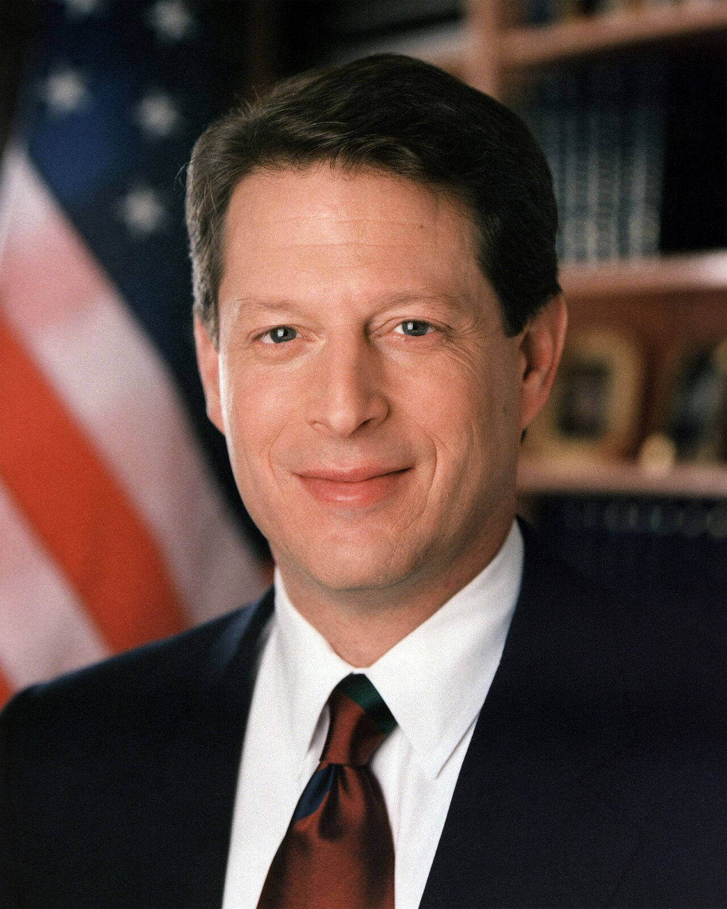

I didn't know this until today, but ARPANET adopted TCP/IP as the official communication protocol between computers on January 1st, 1983. I found this break down of the [two protocols which form TCP/IP](http://january-1-tcp-ip.blogspot.com/2007/12/11-on-this-day-in-history-transmission.html "1/1: On this day in history, transmission control protocol..."). The IP protocol and the TCP protocol is explained below:

### IP

IP ensures that packets are routed to the right place. You can think of a packet as a package of information, and on this package IP holds information about the address and sender (note: your IP address, a number that identifies your computer online is contained in the IP portion of the packet).

When you visit "facebook.com" you ask facebook's servers (computers) to show you its login page. However, your request must typically travel through 10 network nodes (routers) or more before finally reaching the facebook servers.

### TCP

is a "protocol" built on top of IP (every TCP/IP packet has an IP portion). TCP's entire job is ensuring that the connection occurs in an organized matter. To understand TCP's purpose, let's reconsider the package analogy. Say you have to send a script over the "normal" snail mail, and for whatever reason you have to send it in 2 separate packages. This occurs in TCP/IP all the time. So, it's up to the receiver to arrange the individual packages into one whole package. TCP/IP connections have been handled with TCP/IP handshakes since January 1, 1983.

Check out a more technical description of [January 1 tcp/ip](http://january-1-tcp-ip.blogspot.com/2007/12/january-1-83-tcpip.html)   

Al Gore invented the Internet in 1994 to combat global warming. :)