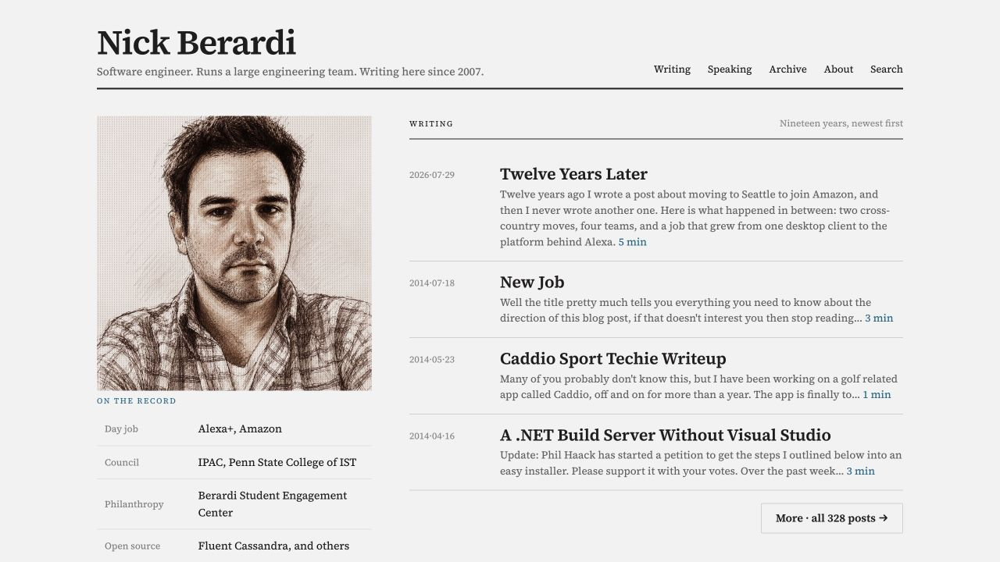

Nobody asked for it, but the blog was feeling dated.

To be fair, *dated* may be underselling it. Until recently, the site ran on a roughly twelve-year-old version of Ghost on an Azure virtual machine. It stayed alive because I kept maintaining the MSDN credentials attached to it. I had forgotten the password, though I knew I could find a way in. Life kept providing better uses for my time.

That is how a temporary situation becomes infrastructure.

I considered updating it over the years, but the blog had become a real project. The content needed to be exported and the old URLs preserved. It also had some history. The site began as Coder Journal, became nickberardi.com, and went from WordPress to something custom to Ghost. Each move left behind a little archaeology.

I had been hearing for years about static site generators like [Hugo](https://gohugo.io/) and hosting a site through [GitHub Pages](https://pages.github.com/). I liked the idea of turning the old database into a pile of Markdown files, putting them on GitHub, and finally shutting down the ancient Azure machine that had been preserving nearly two decades of writing.

Moving hundreds of posts out of an old Ghost SQLite database without losing images or old links sounded like a series of lost evenings, so I left it alone.

## The one-hour migration

Then, on a whim back in February, I was playing with [OpenClaw](https://openclaw.ai/) and asked it how to get access to the SQLite database on that old Azure machine.

It gave me instructions. They worked.

So I pushed a little further and asked it to convert the database into a Hugo site that could run on GitHub Pages. It asked me a few questions, then took off.

Within an hour, I had a working website.

The posts were in Markdown, the site was on GitHub Pages, and the old URLs still worked. The migration was finished before I had time to reconsider starting it.

I was hardly new to AI. I am usually an early adopter and had already spent years using it in my work. OpenClaw was different. I gave it an old database, a half-formed plan, and plenty of opportunities to get lost. It kept going until the blog was running. Like a lot of people trying OpenClaw for the first time, I started looking at every project I had been putting off and wondering which one was next.

## The project was never impossible

None of the work was beyond me. I could have read the schema, written an exporter, cleaned up what it missed, and chased the broken links. The project was possible and still not worth giving up a weekend for.

With OpenClaw, I answered a few questions and reviewed the result instead of spending several evenings wiring everything together. A project that never earned a place on my calendar fit into the hour I had.

## Making it mine

The first version used [PaperMod](https://github.com/adityatelange/hugo-PaperMod). It got the site online quickly and looked like a lot of other Hugo blogs, which was fine. I did not want to design a website during the migration.

Once the posts were safe, the generic look started to bother me. I had carried over everything I had written since 2007, and it felt strange to put that history behind a template that had nothing to do with me.

More recently, I opened [Claude Design](https://claude.com/product/design) and started working through what I wanted. I had no design system and not much vocabulary for it. I could explain what felt off, keep what I liked, and try again.

I spent my time deciding what felt like me instead of translating every opinion into HTML and CSS. The result feels personal rather than assembled from a theme, which is all I wanted.

{class="screenshot"}

*The current nickberardi.com homepage. The content survived the migration, and the design finally feels like it belongs to me.*

## What else have I been putting off?

What has stayed with me is how little of my time it took to get from the idea to a finished site. I have a long list of similar projects. They are worth doing, but almost none is urgent enough to claim a weekend.

Agents are good at the parts that make those projects unattractive. They can trace a database, write one-off code, and chase broken links without getting bored. I still decide what should survive, what looks right, and whether the result is any good.

The blog is running again because AI made the migration cheap enough to attempt on a whim. It looks like mine because the same thing happened with the design. Now when I look at a project I have been putting off, I no longer wonder when I will find a free weekend. I wonder how much of it I can hand off and whether I can get it done this afternoon.
